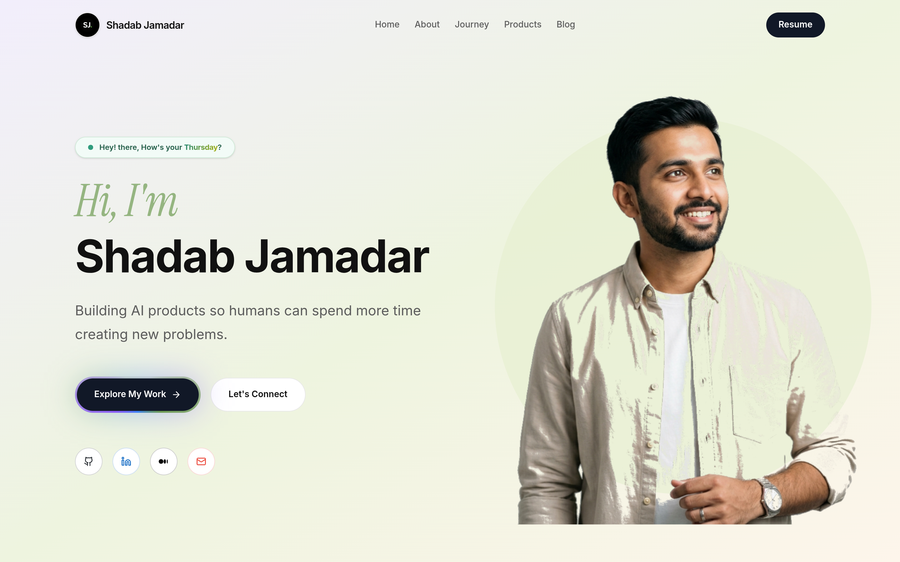
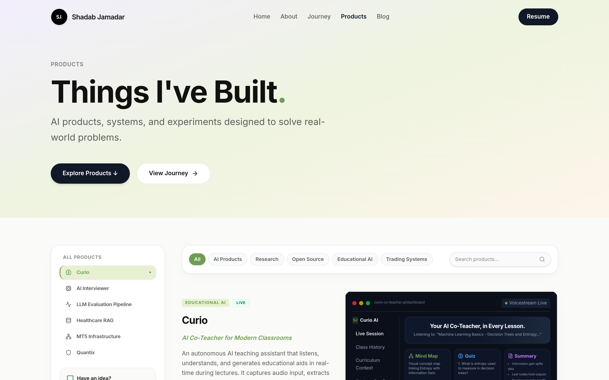
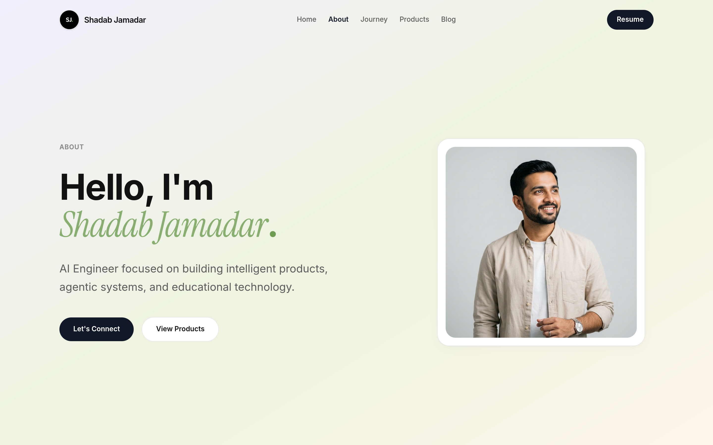
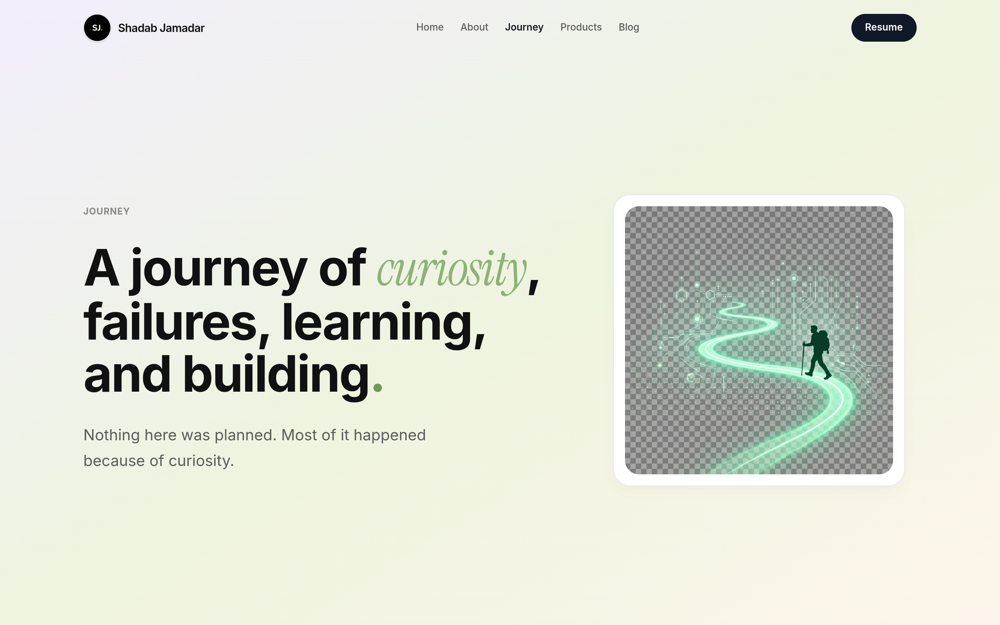
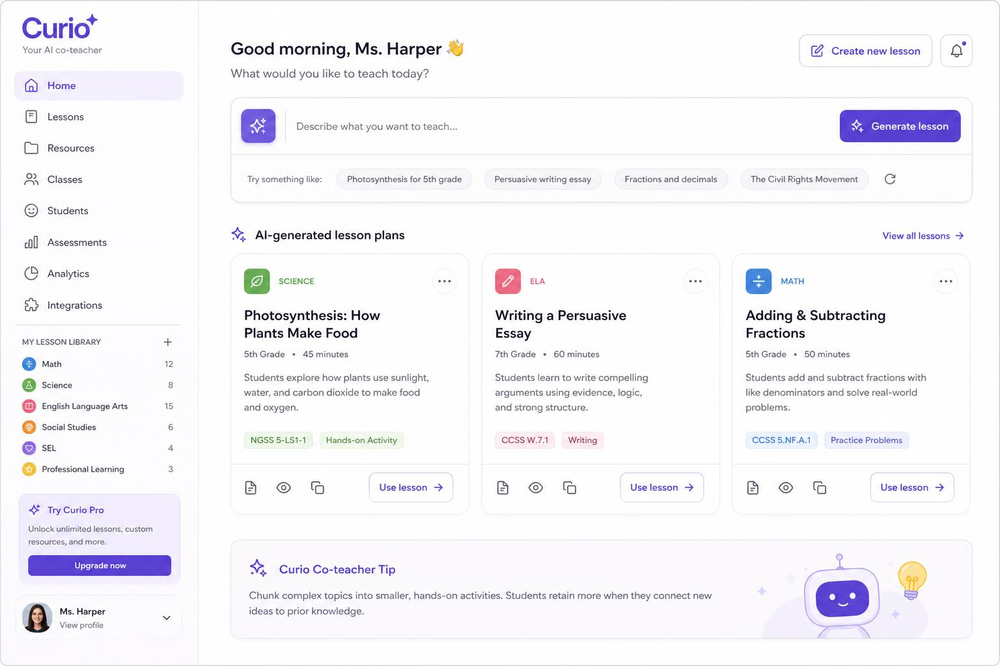
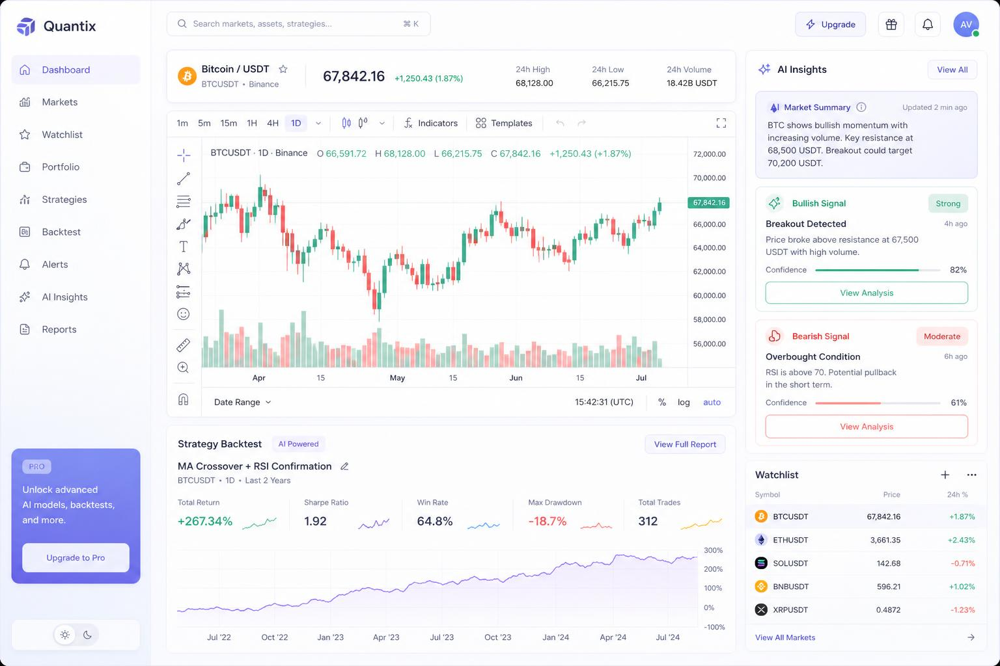
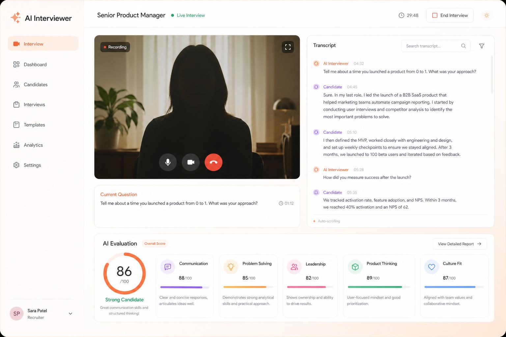

# Shadab Jamadar — AI Engineer & Product Builder Portfolio

Welcome to the official repository for my professional developer portfolio. This application is a premium, highly interactive web application designed to highlight my work in AI engineering, agentic systems, data science, and backend development.

Built with **React 19**, **TypeScript**, and **TanStack Start**, the portfolio is optimized for speed, SEO, and visual excellence, featuring smooth CSS transitions, dynamic widgets, and an interactive skills graph.

---

## Live Previews

| Homepage | Products |
| :---: | :---: |
|  |  |

| About | Journey |
| :---: | :---: |
|  |  |

---

## Product & Section Graphics

Here are some of the primary visual assets and product mockups bundled inside the application:

| Curio - AI Co-Teacher | Quantix - Trading SDK | Interviewer - AI Prep |
| :---: | :---: | :---: |
|  |  |  |

| Journey Hero | First Lines of Code | Portrait Hero |
| :---: | :---: | :---: |
|  |  |  |

---

## Key Features

- **Interactive Skills Graph:** A custom-built SVG/Canvas-based [SkillsGraph](file:///src/components/SkillsGraph.tsx) component showcasing my expertise across machine learning, software engineering, and database systems.
- **Dual-Row Screenshot Marquee:** An aesthetic, scrolling showcase of flagship projects (Curio, Quantix, Interviewer, etc.) with progressive loading indicators.
- **Dynamic Activity Feed:** A provider-based activity aggregator that fetches, formats, and displays real-time updates from GitHub commits/repositories and Medium articles.
- **Thought of the Day Widget:** A calendar-linked dynamic component that reads and serves curated software engineering and AI quotes based on the current calendar date.
- **Professional Journey Timeline:** A interactive, collapsible work experience timeline detailing my accomplishments at Planto AI, Renu Sharma Foundation, and Criql Labs.
- **SEO Optimized:** Handcrafted semantic tags, specific metadata, and OpenGraph definitions configured globally via TanStack Router hooks.
- **Asset Ingestion:** Directly links and serves assets like resume PDFs and images with fallback support.

---

## Technology Stack

- **Runtime & Package Manager:** [Bun](https://bun.sh) (fast lockfile parsing, speedier installations, and native dev commands)
- **Frontend Library:** React 19 (concurrent features, improved rendering)
- **Meta-Framework:** **TanStack Start** (combines Vite for bundling, TanStack Router for route generation/metadata, and Nitro as the backend engine)
- **Styling:** Tailwind CSS v4 (built-in `@tailwindcss/vite` plugin config, custom variables, and keyframe animations in `src/styles.css`)
- **UI Components:** Radix UI primitives & Lucide React for consistent iconography
- **Backend & APIs:** Server handlers built into routing via TanStack Start, featuring an SQLite/filesystem caching layer
- **Deployment:** Configured for Vercel with integrated cron schedules

---

## Repository Structure

```text
├── .antigravitycli/           # Antigravity CLI workspace state (gitignored)
├── .github/                   # GitHub Action configurations
├── .vscode/                   # Pre-configured workspace settings (extensions.json)
├── public/                    # Static public assets (favicons, robots.txt)
├── src/                       # Main source code
│   ├── assets/                # Images, brand logos, and resume PDF
│   ├── components/            # Shared UI components
│   │   ├── ui/                # Radix and custom styling wrappers (Shadcn/ui)
│   │   └── SkillsGraph.tsx    # Custom interactive skills visualizer
│   ├── features/              # Feature-specific logical modules
│   │   ├── recent-activity/   # GitHub & Medium RSS aggregator feature
│   │   └── thought-of-day/    # Core widget and dynamic engine files
│   ├── hooks/                 # Reusable react hooks (e.g. useResumeUrl)
│   ├── lib/                   # Utility helpers and global configurations
│   ├── routes/                # TanStack Router folder
│   │   ├── api/               # API endpoints (e.g. activity-feed route)
│   │   ├── __root.tsx         # Global layout wrapper and head metadata
│   │   └── index.tsx          # Main home page component
│   ├── router.tsx             # TanStack Router instance creation
│   ├── server.ts              # Nitro entry point configuration
│   ├── start.ts               # Router shell entrypoint
│   └── styles.css             # Main styling entrypoint (Tailwind directives & variables)
├── bun.lock                   # Bun lockfile (text-based)
├── bunfig.toml                # Bun configurations
├── components.json            # Shadcn UI configuration file
├── eslint.config.js           # ESLint v9 configuration
├── package.json               # Scripts, dependencies and devDependencies
├── tsconfig.json              # TypeScript compilation rules
└── vercel.json                # Vercel deployment and cron settings
```

---

## Local Development Setup

Follow these steps to set up and run the project locally on your machine.

### Prerequisites

Make sure you have [Bun](https://bun.sh) installed. If you don't have Bun, you can install it using npm or curl:

```bash
# Using npm
npm install -g bun

# On Windows (PowerShell)
powershell -c "irm bun.sh/install.ps1 | iex"
```

### 1. Clone & Install Dependencies

```bash
git clone https://github.com/UnbeatableBann/UnbeatableBann-Portfolio.git
cd UnbeatableBann-Portfolio
bun install
```

### 2. Configure Environment Variables

Create a `.env` file in the root directory. You can use the provided `.env.example` as a template:

```bash
cp .env.example .env
```

Open `.env` and fill in the required parameters:

- `GITHUB_USERNAME`: Your GitHub username (used to fetch commits).
- `GITHUB_TOKEN`: _(Optional)_ A GitHub Personal Access Token to avoid hitting rate limits for public fetches.
- `MEDIUM_USERNAME`: Your Medium username (without the `@` prefix, used to parse your Medium RSS feed).
- `CRON_SECRET`: A secure random token string used to authorize cron trigger requests in production.

### 3. Run the Development Server

Start the development server via:

```bash
bun run dev
```

Open [http://localhost:3000](http://localhost:3000) in your browser to view the application.

### 4. Code Quality & Formatting

To maintain code standards, run the linter and formatter:

```bash
# Run ESLint check
bun run lint

# Run Prettier format
bun run format
```

---

## Build and Production Deployment

### Production Build

Create a production build locally or in CI using:

```bash
bun run build
```

The application will be compiled into the `.output/` and `.tanstack/` folders. You can preview the production bundle locally with:

```bash
bun run preview
```

### Vercel Deployment

The portfolio is fully compatible with Vercel and can be deployed directly:

1.  Connect your repository to **Vercel**.
2.  Add your production environment variables (`GITHUB_USERNAME`, `MEDIUM_USERNAME`, `CRON_SECRET`, etc.) inside the Vercel Dashboard.
3.  Deploy! Vercel will auto-detect the configuration and compile the application.

#### Automated Cache Refreshes

To bypass API rate limits, the portfolio aggregates events on a daily cron task and writes it to `activity-cache.json`.
The [vercel.json](file:///vercel.json) file schedules a cron execution at midnight UTC to hit `/api/activity-feed?refresh=true`. Vercel automatically passes verification using the `CRON_SECRET` variable.

---

## Extending the Codebase

### Adding New Dynamic Sections

1.  **Add Components:** Place reusable visual layouts inside [src/components](file:///src/components) or create a new folder under [src/features](file:///src/features).
2.  **Add Routes:** Create a new page under [src/routes](file:///src/routes) (e.g. `blog.tsx`) and rerun `bun run dev`. TanStack Router will automatically generate the typesafe route trees in `src/routeTree.gen.ts`.
3.  **Add Activity Sources:** Implement the `ActivityProvider` interface and append it in the `ActivityAggregator` inside [aggregator.ts](file:///src/features/recent-activity/aggregator.ts) to pull in items from YouTube, Twitter, or Dev.to.

---

## License

This project is licensed under the MIT License. See the repository configurations for details.
